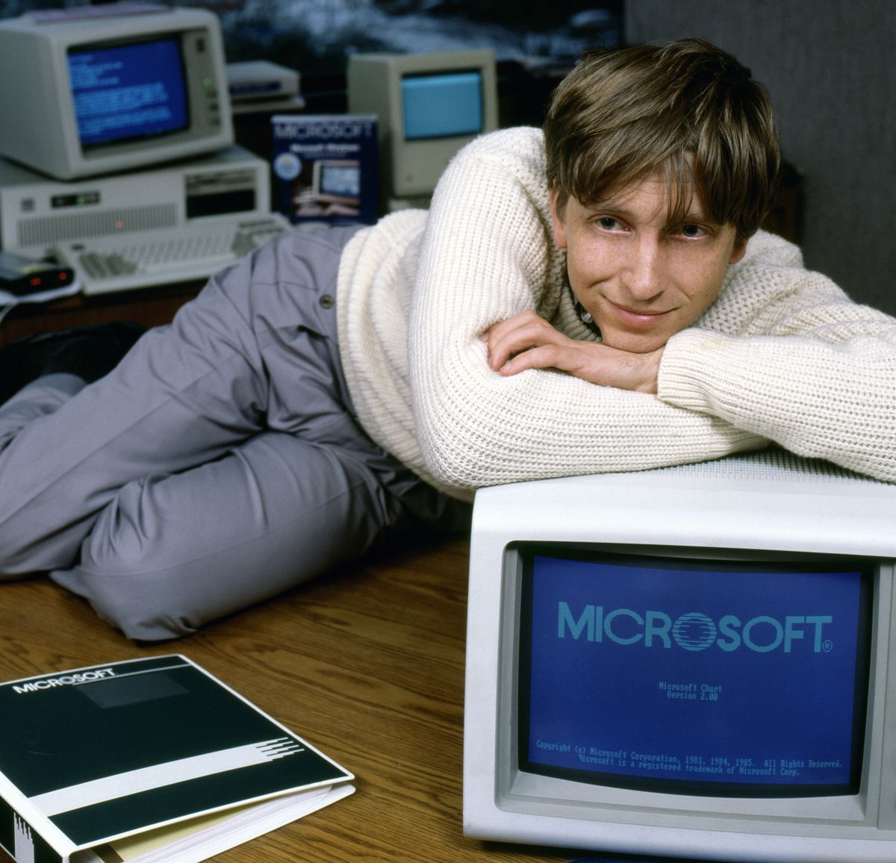
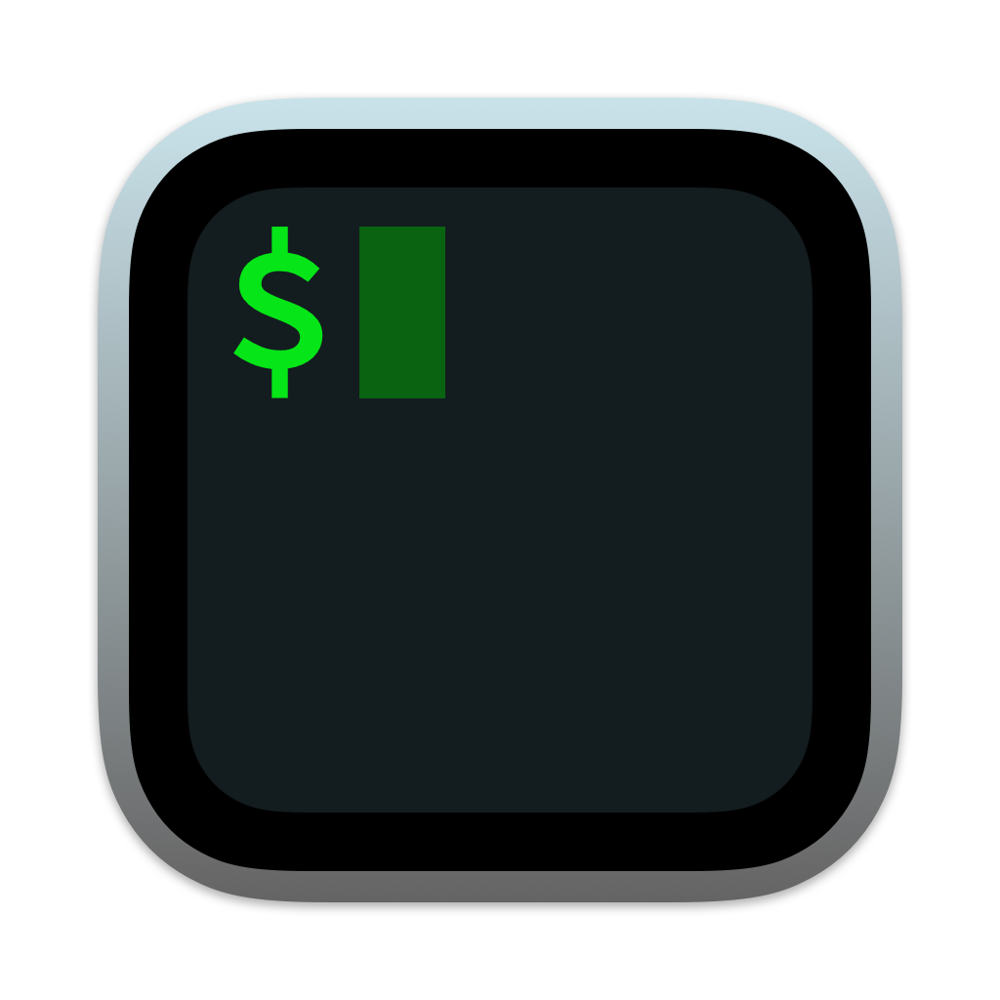
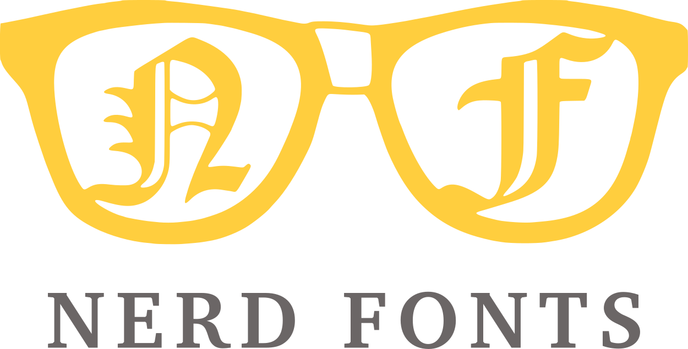
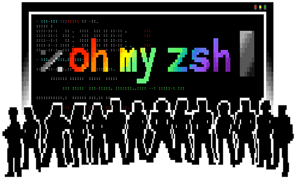
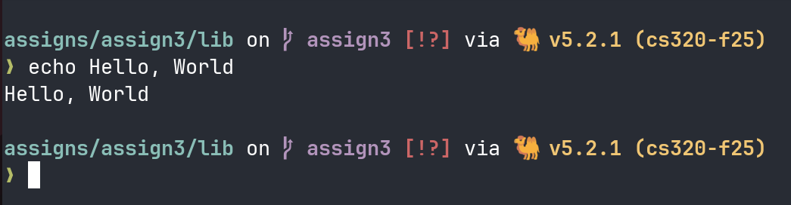

Disclaimer
===
Much of the functionality showcased here doesn't strictly apply for Windows users.
- Consider installing Windows Subsystem for Linux! 

<!-- pause -->


---

Meet Your Terminal
===
# Some short history
Terminal emulators _emulate_ the behavior of classic video terminals, such as DEC's VT100 series from the 1970s. 

Video terminals were a serious evolution from the screenless hard-copy terminals that preceded them.


---

Meet Your Terminal (cont.)
===
# Terminal Power
UNIX-like operating systems such as MacOS, GNU/Linux and the many breeds of BSD make the terminal a first-class citizen.

The terminal allows you to issue commands directly to the computer via the _shell_, plus:
- Navigate the filesystem GUI-free
- Run useful command line programs
- Easy installation of software with package managers
- Look like a hacker in cafes

---

Meet Your Terminal (cont.)
===
# Many Options for Terminals
Most OS-s and DEs are shipped with a perfectly serviceable terminal emulator, but these all have lots to offer!
<!-- column_layout: [2, 1] -->

<!-- column: 0 -->
## Solid options for everyday use
- iTerm2 (MacOS only)
- Alacritty (Linux and MacOS)

## Shiny and new
- Kitty
    - Built in terminal multiplexing 
    - Experimental **image** support
- Ghostty 
    - Strong defaults 
    - Written in _Zig_
    - Recently left private testing stage
- WezTerm
     - Configured in Lua, written in Rust!
     - Cross-platform (Windows, too!)

<!-- column: 1 -->
 
_iTerm2_, a popular terminal emulator for MacOS

<!-- reset_layout -->

---
Meet Your Shell
===

<!-- column_layout: [2, 1] -->

<!-- column: 0 -->
# What the Shell?
The **shell** is a command-line interface _run_ by your terminal at startup.
- Works close to the operating system (interacts with the Kernel API)
- Your gateway to running CLI programs and coreutils (`cd`, `touch`, `rm`, etc.)
- Accompanied by a robust scripting language for complicated operations and automation

# Introducing Z Shell
Zsh (Z Shell) is the modern choice.
- Default login shell on MacOS since **2019** (Admittedly for licensing reasons...)
    - Highly extensible with a thriving ecosystem of community plugins
- Most Linux distros still default to Bash, but Zsh is available in their repos

<!-- column: 1 -->

 
_Bash (Bourne-Again Shell)_


 
_Z Shell_

<!-- reset_layout -->

---

Glyphs
===
# Nerd Fonts
- CLI programs can take advantage of hundreds of glyphs and special symbols
- Nerd Fonts patches all of the best monospaced typefaces with icons for maximum compatibility

Pick your favorite at [](https://www.nerdfonts.com/font-downloads)

 

---

Colors
===
# Your Color Scheme
Terminal emulators are usually limited to 8 colors for display.
- Each color gets a light and dark shade, for a total of 16 

## Do It the Easy Way
Defining your own color schemes is absolutely doable, but there's tools to do it for you.

- [](https://terminal.sexy/)
- [](https://gogh-co.github.io/Gogh/)

 

---

Oh My Zsh
===
# Oh my!
A community-driven, open-source framework for extending Zsh with plugins.
- Flashy, functional prompts
- Completions and autosuggestions
- Much more!

See more at [](https://ohmyz.sh/)

 

---

Starship
===
# A prompt that's out of this world
**Starship** is a blazing-fast, customizable prompt for any shell.
- Use one of their _many_ presets, or write your own!
- See your current Git branch, the language versions active in your cwd, etc., all in your prompt!

See more at [](https://starship.rs/)


 


---

TMUX
===

# Meet tmux
`tmux` is a _terminal multiplexer_ that splits one terminal session into many!

Keep all your processes running _simultaneously_ while you're:
- Editing code 
- Testing in a REPL
- Running a server 
- ssh'd into a remote machine

Available through Homebrew (MacOS) and your Linux distro's repositories.

## Don't go alone!
TPM is a plugin manager that makes theming and extending tmux a breeze.

<!-- pause -->
```
set -g @plugin 'tmux-plugins/tpm'
set -g @plugin 'tmux-plugins/tmux-resurrect'
set -g @plugin 'tmux-plugins/tmux-continuum'

# Initialize TMUX plugin manager (keep this line at the very bottom of tmux.conf)
run '~/.tmux/plugins/tpm/tpm'

```
---

Aliases
===
# Why type more?
**Aliases** let you define _shorthand_ for long or difficult to remember commands.
- Run utils with all the flags you like, every time

<!-- pause -->
```shell
# in your .bashrc or .zshrc
alias c=clear
alias v=nvim
alias ls=eza -la
alias now='date +"%T"'
```

---
Honorable Mentions
===
# Lest we forget...
- eza
- fastfetch
- btop
- presenterm
- topgrade


